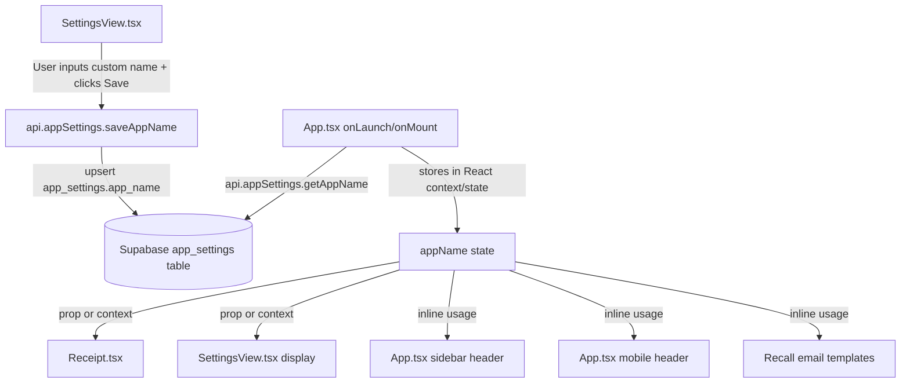

# Plan: Dynamic "DentalCloudPro" App Title

## Overview

Replace the hardcoded `DentalCloudPro` brand name throughout the application with a user-configurable setting stored in the Supabase `app_settings` table. The custom title will be editable from the Settings page, persisted to the database, loaded on app startup, and reflected everywhere the brand name appears — including navigation bars, receipts, and email templates.

---

## Architecture



---

## Step-by-Step Implementation Tasks

### Step 1: Database — Add `app_name` column to `app_settings`

**File:** [`database/complete_database_setup.sql`](database/complete_database_setup.sql)

Add a new column to the `app_settings` table:

```sql
-- Add custom app name support
ALTER TABLE app_settings
ADD COLUMN app_name VARCHAR(255) DEFAULT 'DentalCloud Pro';
```

**Migration script** (to run in Supabase SQL Editor):

```sql
-- Migration: Add app_name column to app_settings
ALTER TABLE IF EXISTS app_settings
ADD COLUMN IF NOT EXISTS app_name VARCHAR(255) DEFAULT 'DentalCloud Pro';

-- Ensure the singleton row exists
INSERT INTO app_settings (id, app_name)
VALUES (1, 'DentalCloud Pro')
ON CONFLICT (id) DO NOTHING;
```

Also update the `CREATE TABLE app_settings` section in [`database/complete_database_setup.sql`](database/complete_database_setup.sql) to include the new column:

```sql
CREATE TABLE app_settings (
  id SMALLINT PRIMARY KEY DEFAULT 1 CHECK (id = 1),
  
  -- ... existing columns ...
  
  app_name VARCHAR(255) DEFAULT 'DentalCloud Pro',
  
  created_at TIMESTAMP WITH TIME ZONE DEFAULT NOW(),
  updated_at TIMESTAMP WITH TIME ZONE DEFAULT NOW()
);
```

---

### Step 2: API Service — Add `getAppName` / `saveAppName` methods

**File:** [`services/api.ts`](services/api.ts)

Add two new methods inside the `appSettings` object (after `saveClinicalFeeSettings`):

```typescript
getAppName: async (): Promise<string> => {
  try {
    const { data, error } = await supabase
      .from('app_settings')
      .select('app_name')
      .eq('id', APP_SETTINGS_SINGLETON_ID)
      .maybeSingle();

    if (error || !data?.app_name) {
      return 'DentalCloud Pro';
    }

    return data.app_name;
  } catch (error: any) {
    console.warn('Failed to load app name:', error?.message || error);
    return 'DentalCloud Pro';
  }
},

saveAppName: async (name: string): Promise<void> => {
  const trimmed = name.trim();
  if (!trimmed) {
    throw new Error('App name cannot be empty.');
  }

  const payload = {
    id: APP_SETTINGS_SINGLETON_ID,
    app_name: trimmed,
    updated_at: new Date().toISOString()
  };

  const { error } = await supabase
    .from('app_settings')
    .upsert(payload);

  if (error) {
    throw new Error(error.message);
  }
}
```

---

### Step 3: App State — Load app name on startup and expose globally

**File:** [`App.tsx`](App.tsx)

1. Add a new state variable:
   ```typescript
   const [appName, setAppName] = useState<string>('DentalCloud Pro');
   ```

2. Load app name during the initial data fetch (inside the `useEffect` that runs on mount, around line 524-557). Add this call alongside the clinical fee settings fetch:
   ```typescript
   // Load custom app name
   api.appSettings.getAppName()
     .then((name) => {
       if (mounted) setAppName(name);
     })
     .catch((err) => {
       console.warn('Failed to load app name:', err);
     });
   ```

3. Pass `appName` and `onSaveAppName` to `SettingsView`:
   ```tsx
   <SettingsView
     // ... existing props ...
     appName={appName}
     onSaveAppName={async (name: string) => {
       await api.appSettings.saveAppName(name);
       setAppName(name);
     }}
   />
   ```

4. Replace all hardcoded `DentalCloudPro` references in the JSX with `{appName}`:
   - **Sidebar header** (line 2181): `<span>...DentalCloud<span className="text-indigo-400">Pro</span></span>` → use `{appName}`
   - **Mobile header** (line 2156): `<span>...DentalCloud<span className="text-indigo-400">Pro</span></span>` → use `{appName}`
   - **Doctor header title** (line 2112): `const doctorViewTitle = 'Doctor Dashboard';` → keep as-is (this is a view title, not brand name)

   **Note:** For the sidebar/mobile headers, since the app name is user-configurable, we should display it as plain text without the split styling. Replace:
   ```tsx
   <span className="text-xl font-black text-white tracking-tight text-center">
     DentalCloud<span className="text-indigo-400">Pro</span>
   </span>
   ```
   with:
   ```tsx
   <span className="text-xl font-black text-white tracking-tight text-center">
     {appName}
   </span>
   ```

---

### Step 4: Settings Page UI — Add app name input field

**File:** [`components/SettingsView.tsx`](components/SettingsView.tsx)

1. Add new props to the `SettingsViewProps` interface:
   ```typescript
   appName: string;
   onSaveAppName: (name: string) => Promise<void>;
   ```

2. Add local state for the input:
   ```typescript
   const [appNameInput, setAppNameInput] = useState<string>(appName);
   const [appNameMessage, setAppNameMessage] = useState<string>('');
   ```

3. Sync local state when prop changes:
   ```typescript
   useEffect(() => {
     setAppNameInput(appName);
   }, [appName]);
   ```

4. Add a new settings section (after the "Connected Database" section, around line 426):

   ```tsx
   {/* App Name / Branding Settings */}
   <div className="border border-gray-200 rounded-xl p-6">
     <div className="flex items-center gap-3 mb-4">
       <svg className="w-5 h-5 text-indigo-600" fill="none" stroke="currentColor" viewBox="0 0 24 24">
         <path strokeLinecap="round" strokeLinejoin="round" strokeWidth={2} d="M10.325 4.317c.426-1.756 2.924-1.756 3.35 0a1.724 1.724 0 002.573 1.066c1.543-.94 3.31.826 2.37 2.37a1.724 1.724 0 001.066 2.573c1.756.426 1.756 2.924 0 3.35a1.724 1.724 0 00-1.066 2.573c.94 1.543-.826 3.31-2.37 2.37a1.724 1.724 0 00-2.573 1.066c-.426 1.756-2.924 1.756-3.35 0a1.724 1.724 0 00-2.573-1.066c-1.543.94-3.31-.826-2.37-2.37a1.724 1.724 0 00-1.066-2.573c-1.756-.426-1.756-2.924 0-3.35a1.724 1.724 0 001.066-2.573c-.94-1.543.826-3.31 2.37-2.37.996.608 2.296.07 2.572-1.065z" />
         <path strokeLinecap="round" strokeLinejoin="round" strokeWidth={2} d="M15 12a3 3 0 11-6 0 3 3 0 016 0z" />
       </svg>
       <h3 className="text-lg font-semibold text-gray-800">App Branding</h3>
     </div>
     <p className="text-sm text-gray-600 mb-4">
       Customize the application name displayed in the navigation bar, receipts, and system headers.
     </p>

     <div className="space-y-4">
       <Input
         label="Application Name"
         value={appNameInput}
         onChange={(e: any) => {
           setAppNameMessage('');
           setAppNameInput(e.target.value);
         }}
         placeholder="DentalCloud Pro"
       />

       <button
         type="button"
         onClick={async () => {
           try {
             setAppNameMessage('');
             await onSaveAppName(appNameInput);
             setAppNameMessage('App name updated successfully. Changes apply immediately.');
           } catch (error: any) {
             setAppNameMessage(error?.message || 'Failed to save app name.');
           }
         }}
         className="w-full md:w-auto rounded-xl bg-indigo-600 px-5 py-3 text-sm font-bold text-white shadow-lg shadow-indigo-600/20 transition hover:bg-indigo-700"
       >
         Save App Name
       </button>

       {appNameMessage && (
         <p className={`text-xs ${appNameMessage.toLowerCase().includes('failed') ? 'text-red-600' : 'text-emerald-600'}`}>
           {appNameMessage}
         </p>
       )}
     </div>
   </div>
   ```

5. Update the `About` section (line 1096-1134) to use `appName` instead of hardcoded "DentalCloud Pro":
   ```tsx
   <h3 className="text-lg font-semibold text-gray-800">About {appName}</h3>
   ```

---

### Step 5: Receipt Component — Use dynamic app name

**File:** [`components/Receipt.tsx`](components/Receipt.tsx)

1. Add `appName` to the `ReceiptProps` interface:
   ```typescript
   interface ReceiptProps {
     patient: Patient;
     treatments: ClinicalRecord[];
     medicines?: MedicineSale[];
     paymentAmount?: number;
     currency: Currency;
     appName: string;          // <-- new
     onClose: () => void;
   }
   ```

2. Destructure `appName` from props.

3. Replace all hardcoded `DentalCloudPro` references:
   - **Line 163** (screen header): `<h1 className="text-4xl font-black text-gray-900 mb-2">DentalCloud<span className="text-indigo-600">Pro</span></h1>`
     → `<h1 className="text-4xl font-black text-gray-900 mb-2">{appName}</h1>`
   - **Line 273** (print header): Same replacement.
   - **Line 165** (email/phone line): Keep as-is (clinic contact info, not brand name).
   - **Line 247** (footer): `Thank you for choosing DentalCloud Pro for your dental care needs.`
     → `Thank you for choosing {appName} for your dental care needs.`
   - **Line 357** (print footer): Same replacement.

4. Pass `appName` from `App.tsx` where `<Receipt>` is rendered (line 3242):
   ```tsx
   <Receipt
     patient={selectedPatient}
     treatments={...}
     medicines={...}
     paymentAmount={lastPaymentAmount}
     currency={currency}
     appName={appName}
     onClose={...}
   />
   ```

---

### Step 6: Recall Email Template — Use dynamic app name

**File:** [`App.tsx`](App.tsx)

In the `handleSendRecallEmail` function (around line 1534), replace hardcoded references:

- **Line 1537**: `<h1 style="...">🦷 Dental Recall Notice</h1>` → keep as-is (this is the email subject line, not brand name)
- **Line 1559**: `DentalCloud Clinic Management System` → `{appName}`
- **Line 1568**: `fromName: emailSettings.senderName || 'DentalCloud Clinic'` → `fromName: emailSettings.senderName || appName`

---

### Step 7: Utility Cleanup — Update `clinicName.ts` to use DB-backed value

**File:** [`utils/clinicName.ts`](utils/clinicName.ts)

Since we're now storing the app name in Supabase, update the utility to prefer the DB-backed value while falling back to localStorage for backward compatibility:

```typescript
const CLINIC_NAME_KEY = 'dc_clinic_name';
const DEFAULT_CLINIC_NAME = 'DentalCloud Pro';

// This will be replaced by the DB-backed value loaded in App.tsx
// Keep as a synchronous fallback for components that don't have access to the async value
export function getClinicName(): string {
  try {
    const stored = localStorage.getItem(CLINIC_NAME_KEY);
    if (stored) {
      const parsed = JSON.parse(stored);
      if (typeof parsed === 'string' && parsed.trim()) {
        return parsed.trim();
      }
    }
  } catch (error) {
    // Ignore parse errors
  }
  return DEFAULT_CLINIC_NAME;
}

export function saveClinicName(name: string): void {
  localStorage.setItem(CLINIC_NAME_KEY, JSON.stringify(name.trim() || DEFAULT_CLINIC_NAME));
}

export function getClinicShortName(): string {
  return getClinicName();
}
```

No changes needed here — the utility already works. The DB-backed value in `App.tsx` state will be the source of truth, and this utility remains as a synchronous fallback.

---

## Files Modified Summary

| File | Change |
|------|--------|
| [`database/complete_database_setup.sql`](database/complete_database_setup.sql) | Add `app_name` column to `app_settings` CREATE TABLE |
| [`services/api.ts`](services/api.ts) | Add `getAppName()` and `saveAppName()` methods |
| [`App.tsx`](App.tsx) | Add `appName` state, load on mount, pass to children, replace hardcoded strings |
| [`components/SettingsView.tsx`](components/SettingsView.tsx) | Add App Branding section with input + save button |
| [`components/Receipt.tsx`](components/Receipt.tsx) | Accept `appName` prop, replace hardcoded brand references |
| [`utils/clinicName.ts`](utils/clinicName.ts) | No changes needed (backward-compatible fallback) |

---

## Testing Instructions

### In WeChat Developer Tool

1. **Settings page**: Navigate to Settings → App Branding section. Enter a custom name (e.g., "My Dental Clinic") and click Save. Verify success message appears.
2. **Navigation bar**: After saving, navigate to other pages. Verify the sidebar and mobile header show the new name.
3. **Receipt**: Open a patient, process a payment, generate a receipt. Verify the receipt header shows the custom name.
4. **Persistence**: Close and reopen the app. Verify the custom name persists.
5. **Edge case**: Try saving an empty name — verify error message. Try very long names — verify they display correctly (truncation may occur in sidebar).

### On Real Device

1. Install the mini program on a test device.
2. Follow the same steps as above.
3. Test receipt printing — verify the custom name appears on the printed receipt.
4. Test recall email sending — verify the custom name appears in the email body.

### Rollback

If issues occur, run the following SQL to reset to default:

```sql
UPDATE app_settings SET app_name = 'DentalCloud Pro', updated_at = NOW() WHERE id = 1;
```

---

## Migration Script (for Supabase SQL Editor)

```sql
-- ============================================================
-- Migration: Add app_name column to app_settings
-- Run this in your Supabase SQL Editor
-- ============================================================

-- Add the column if it doesn't exist
ALTER TABLE IF EXISTS app_settings
ADD COLUMN IF NOT EXISTS app_name VARCHAR(255) DEFAULT 'DentalCloud Pro';

-- Ensure the singleton row exists with the default value
INSERT INTO app_settings (id, app_name)
VALUES (1, 'DentalCloud Pro')
ON CONFLICT (id) DO NOTHING;
```
